

  <picture>
    <source media="(prefers-reduced-motion: reduce)" srcset="assets/hero-static.svg">
    
  </picture>

  <picture>
    <source media="(prefers-reduced-motion: reduce)" srcset="assets/ui/intro-static.svg">
    <source media="(prefers-color-scheme: dark)" srcset="https://readme-typing-svg.demolab.com/?font=JetBrains+Mono&weight=500&size=21&duration=3000&pause=1200&color=00B7FF&center=true&vCenter=true&width=900&height=56&lines=DevOps%20%C2%B7%20web%20%C2%B7%20cloud%20%E2%80%94%20building%20from%20Torino;Next.js%20%2B%20Supabase%2C%20shipped%20on%20Vercel%20%26%20Cloudflare;Currently%3A%20LMS%20%26%20web%20interfaces%20%40%20inRebus;Source%20every%20claim.%20Ship%20small.%20Iterate.">
    
  </picture>

  
  <a href="https://www.linkedin.com/in/amirhossein-akbari-9075b3360">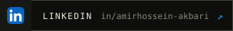</a>
  <a href="https://github.com/AMIRAK-code?tab=repositories">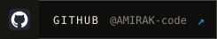</a>

I'm Amir — a developer in Torino working where web apps meet the infrastructure that ships them. Weekdays go to LMS and web interfaces at **inRebus**; the rest goes to small, opinionated builds: an exam-prep platform that won't state a rule it can't source, AI certification courses running on Cloudflare Workers, and a couple of browser extensions. I study Computer Engineering at Politecnico di Torino.

 

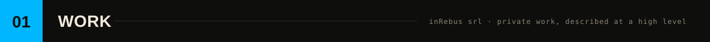

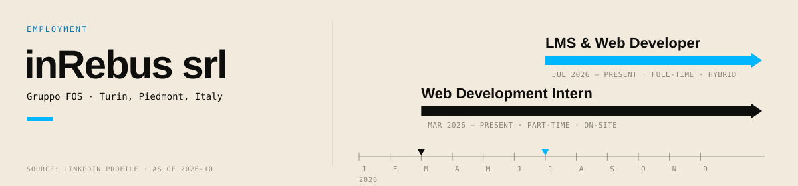

  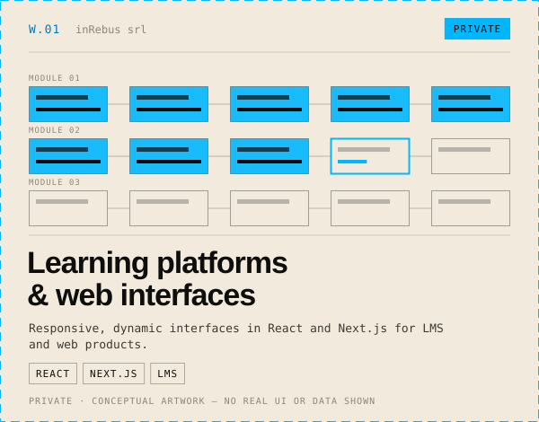
  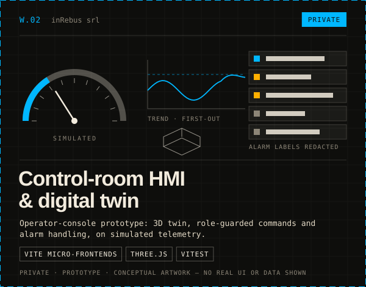

Work at inRebus is private: these cards describe it at a high level and use conceptual artwork only.

  

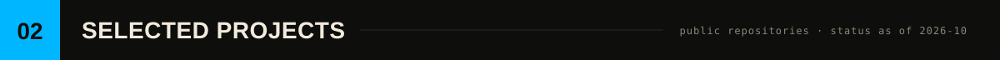

  <a href="https://github.com/AMIRAK-code/EXAMassist">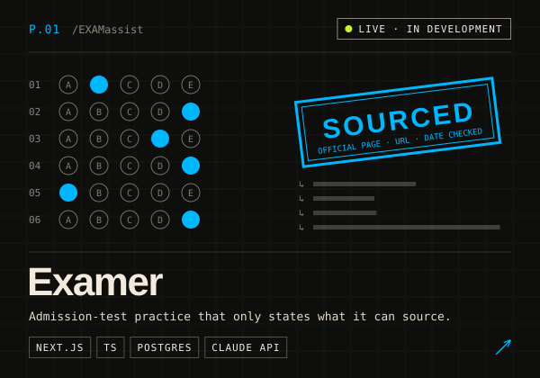</a>
  <a href="https://github.com/AMIRAK-code/TEchCERT">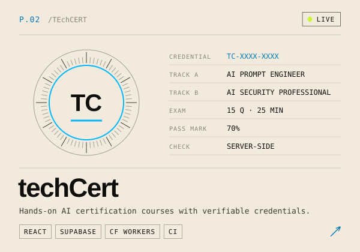</a>
  <a href="https://github.com/AMIRAK-code/fundable-mvp-t1">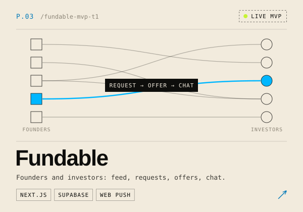</a>
  <a href="https://github.com/AMIRAK-code/walkscape">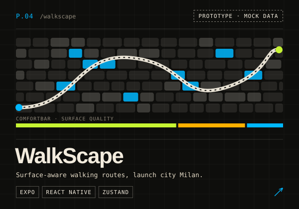</a>
  <a href="https://github.com/AMIRAK-code/napoliwalks">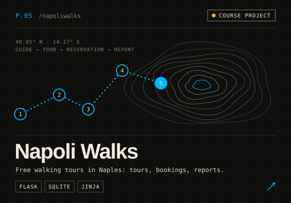</a>
  <a href="https://github.com/AMIRAK-code/StickyNOte-broswerExtenstion">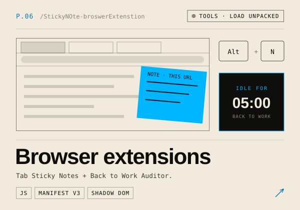</a>

**P.01 Examer** · LIVE · IN DEVELOPMENT 
Practice for the Bocconi test, SAT, ACT, LSAT, GMAT, GRE, PoliTo TIL and CISIA TOLC. Eleven versioned exam configurations, each rule traced to the test maker's own pages; an original question bank; a server-side AI tutor on the Claude API. 
`Next.js` `TypeScript` `PostgreSQL / SQLite` `Claude API` `Vitest` `Playwright` — [repo](https://github.com/AMIRAK-code/EXAMassist) · [live](https://exa-massist.vercel.app)

**P.02 techCert** · LIVE 
Two courses — AI Prompt Engineer and AI Security Professional — with interactive labs, a timed exam and certificates checked server-side. Deployed to Cloudflare Workers; lint, build and database tests run in GitHub Actions. 
`React` `Vite` `Supabase` `Cloudflare Workers` `GitHub Actions` — [repo](https://github.com/AMIRAK-code/TEchCERT) · [live](https://techcert.assist365.app)

**P.03 Fundable** · LIVE MVP 
Founder–investor matching with role-specific profiles, connection requests and offers, message rooms and web-push notifications, on Supabase auth and Postgres. 
`Next.js` `TypeScript` `Supabase` `Web Push` `shadcn/ui` — [repo](https://github.com/AMIRAK-code/fundable-mvp-t1) · [live](https://fundable-mvp-t1.vercel.app)

**P.04 WalkScape** · PROTOTYPE · MOCK DATA 
Expo / React Native app that routes around cobblestones, grates and wet pavement. Thirteen screens on fixture data and an SVG mock map; Supabase and Mapbox are stubbed. 
`Expo` `React Native` `TypeScript` `Zustand` — [repo](https://github.com/AMIRAK-code/walkscape)

**P.05 Napoli Walks** · COURSE PROJECT 
Exam project for *Introduction to Web Applications*: guides publish tours, participants reserve places, guides file post-tour reports. 
`Python` `Flask` `Flask-Login` `SQLite` `Jinja` — [repo](https://github.com/AMIRAK-code/napoliwalks)

**P.06 Browser extensions** · TOOLS · LOAD UNPACKED 
Two Manifest V3 Chrome extensions in vanilla JavaScript: per-URL sticky notes toggled with <kbd>Alt</kbd>+<kbd>N</kbd>, and an idle monitor that locks the tab with an overlay and chime. Both isolate their UI in Shadow DOM. 
`JavaScript` `Chrome MV3` `Shadow DOM` — [Tab Sticky Notes](https://github.com/AMIRAK-code/StickyNOte-broswerExtenstion) · [Back to Work Auditor](https://github.com/AMIRAK-code/idle-monitor-alert)

**Also on the bench:** [Dumb Chess](https://github.com/AMIRAK-code/DUMB-CHESS-v1.0-beta) — chess with friendly fire, Express + Pug · [Air hockey](https://github.com/AMIRAK-code/camera-vision-air-hocky-v1.0) — hand-tracked two-player game, OpenCV + MediaPipe · [Wine Pairer](https://github.com/AMIRAK-code/WinePairer) — offline pairing lookup, Tkinter + pandas · [REfluenz](https://github.com/AMIRAK-code/REfluenz-app) — creator-platform UI on a mock API, React

 

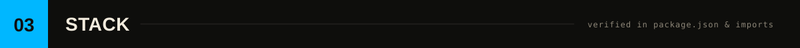

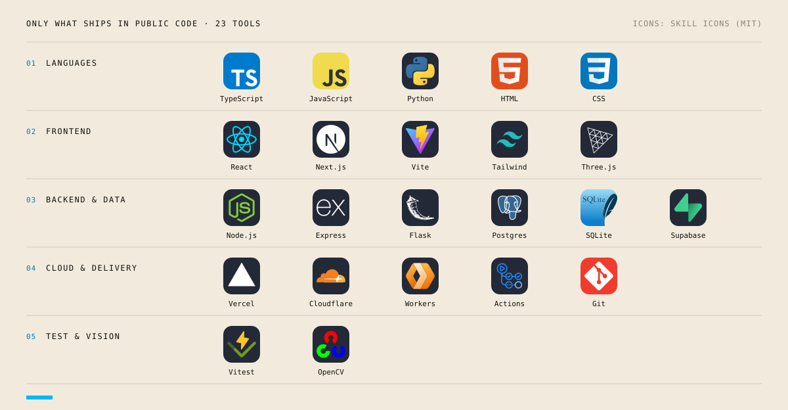

 

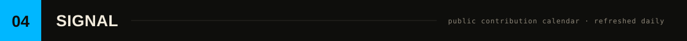


Drawn from the public contribution calendar by [`scripts/activity.mjs`](scripts/activity.mjs) and refreshed daily by [`.github/workflows/activity.yml`](.github/workflows/activity.yml). The snapshot date and range are printed on the image; if a refresh fails, the previous image stays.

  

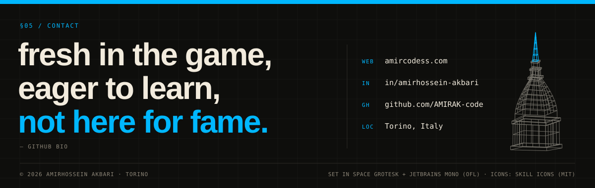

  
  
  

Artwork generated by <a href="scripts/build-assets.mjs">scripts/build-assets.mjs</a> · Fonts: Space Grotesk &amp; JetBrains Mono (SIL OFL 1.1) · Icons: <a href="https://github.com/tandpfun/skill-icons">Skill Icons</a> (MIT) · Typing line: <a href="https://github.com/DenverCoder1/readme-typing-svg">Readme Typing SVG</a> · <a href="THIRD_PARTY_NOTICES.md">notices</a>

